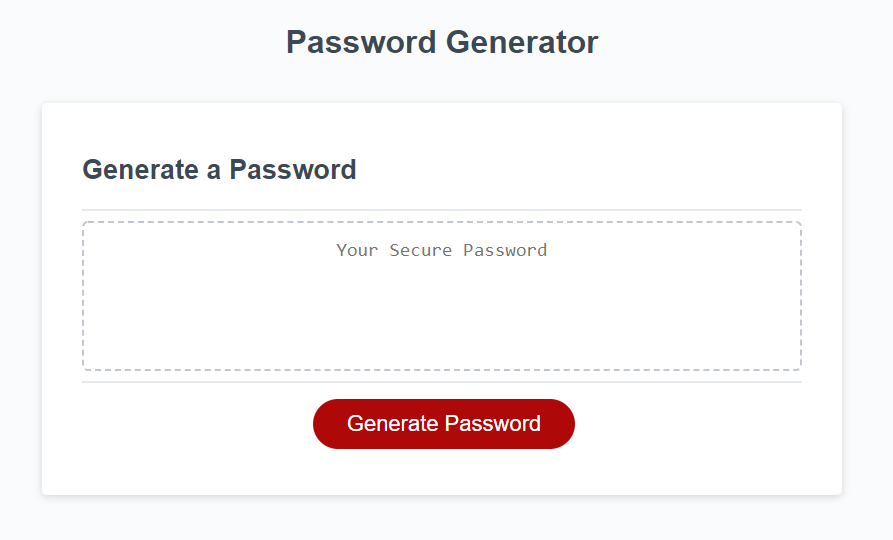

# Password-Generator

## The Security Question

I wanted to build an app that could take user imput data and return a string of characters that can be used for generating passwords. I personally hate nothing more than having to hastily come up with a new secure password for evey site I visit these days. Well this handy little app takes the pressure off.

After a few simple questions this password generator can produce a string of characters (uppercase, lowercase, numbers, and special characters) to provide a unique password. 

## Tools used

For this project I wanted to push my understanding of the use of JavaScripts loops and conditionals. Finding a way to take in a wide array of information. In this case characters on a keyboard, and create statements that would pull the data requested, store it then at the end return a unique password randomly selected from all the data points aquired. While making sure the app would only run under the propper conditions. I.e making sure a valid number is entered into how long of a passwrod the user wants, making sure that the password length is answered with a number, as well as the final output holds at least one of each type of selected character.

## Take Aways

I feel I have a much stronger grasp of the flow of a JS function. How to push info from various arrays into a master array. And using concepts like Math.floor and Math.random to access the information within that final array.

### Give it a try

https://insideseanshead.github.io/Password-Generator/.